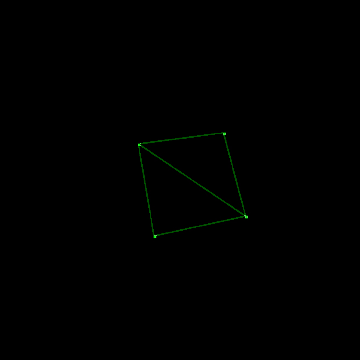
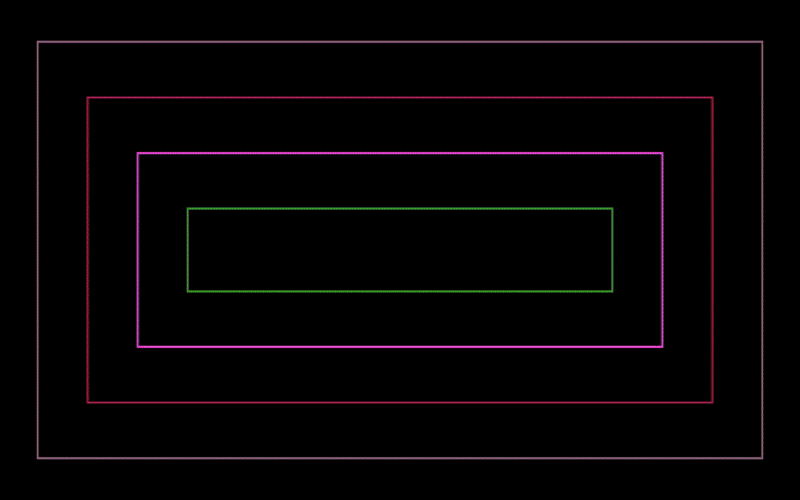

# 3D Renderer

A **3D Renderer** I created using **C & SDL** for my **CISC 3620 Computer Graphics** course! 
* Ensure you have all available imports installed before trying to compile.

## Demos
### Existing 'main.c'


* **Backface Culling:** Determining which faces of the cube are not visible to the camera and skipping their rendering to improve performance.
* **Complex Shapes:** Rendering more complex shapes or multiple objects using Triangles  and lines instead of points.
* **Lighting and Shading:** Implementing basic lighting models to add realism.
* **Optimization Techniques:** Implementing optimizations for better performance.

### Midterm


* **Timed Animation:** This animation is timed based on the song **[Gunna - Blackjack](https://www.youtube.com/watch?v=NqDljLQzzqg)**
* **Complex Shapes:** Rendering more complex shapes or multiple objects.
* **Lighting and Shading:** Implementing basic lighting models to add realism.
* **Optimization Techniques:** Implementing optimizations for better performance.

### Old Cube


* **Vertex Definitions:** Defining the vertices of the cube.
* **Transformation Matrices:** Applying transformations like translation, rotation, and scaling to animate the cube.
* **Backface Culling:** Determining which faces of the cube are not visible to the camera and skipping their rendering to improve performance.
* **Rendering Loop:** Continuously updating the cube's position and rendering it to the screen.

## Usage:

1. **Clone this Repo and move to it's associated directory.**
```bash
git clone https://github.com/amirb2607/3D-Renderer.git

cd 3D-Renderer
```

### **You can choose a .c file you want to view.**
* ***Move current 'main/midterm.c' file in src to root, replace it with the associated '.c' file you want to view.***
    * Existing = './src/main.c'

    * Midterm = './Midterm Code/midterm.c'

    * Old Cube = './Old Cube Code/main.c'

2. **Use Makefile to build 'main/midterm.c' file in the src folder.**

```bash
    make build
```

3. **Use Makefile to run the compiled '.c' file.**

```bash
    make run
```

#### **Use ESC to exit the Fullscreen Animation**

4. **After you are finished viewing the animation, use the Makefile to clean up the compiled '.c' file.**

```bash
    make clean
```
